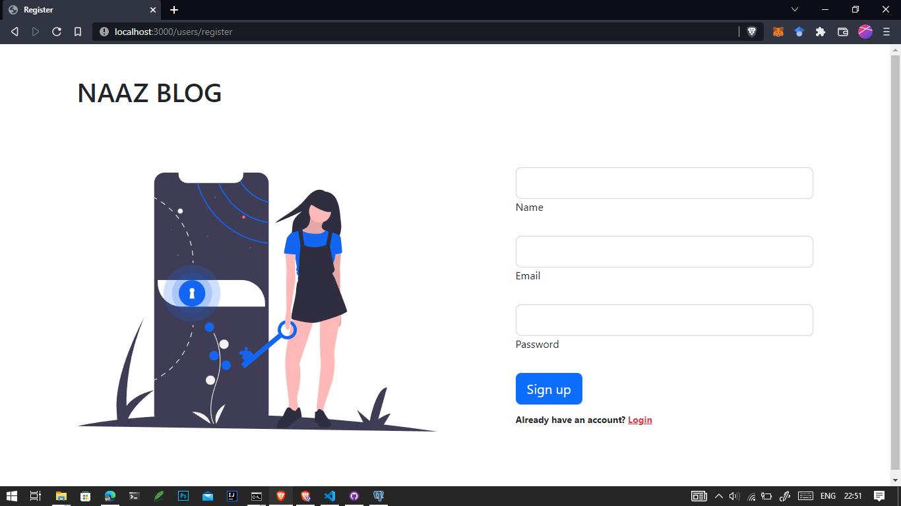
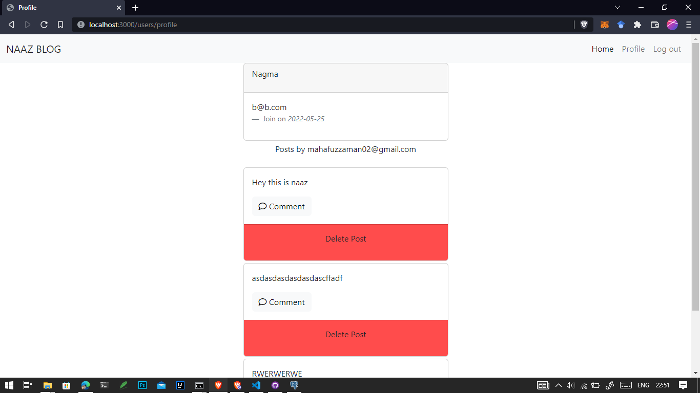

# Naaz Blog

* Passport.js for authorization.
* Create Post, Delete Post, Comment.
* For backend have used Node js and Express
* For database have used Postgresql

# Run on your instance

* Step 1

```
git clone https://github.com/Nagma24/Blog-website.git
```

run **npm i**.

* Step 3

Import the schema of database app.sql

* Step 4

Configure "pgConfig.js" and "passport-config.js"

* Step 5
To start the server run **node app.js**

# ScreenSort

## Login Page


## Register Page



## Home Page


## Comment Page


## Profile Page


